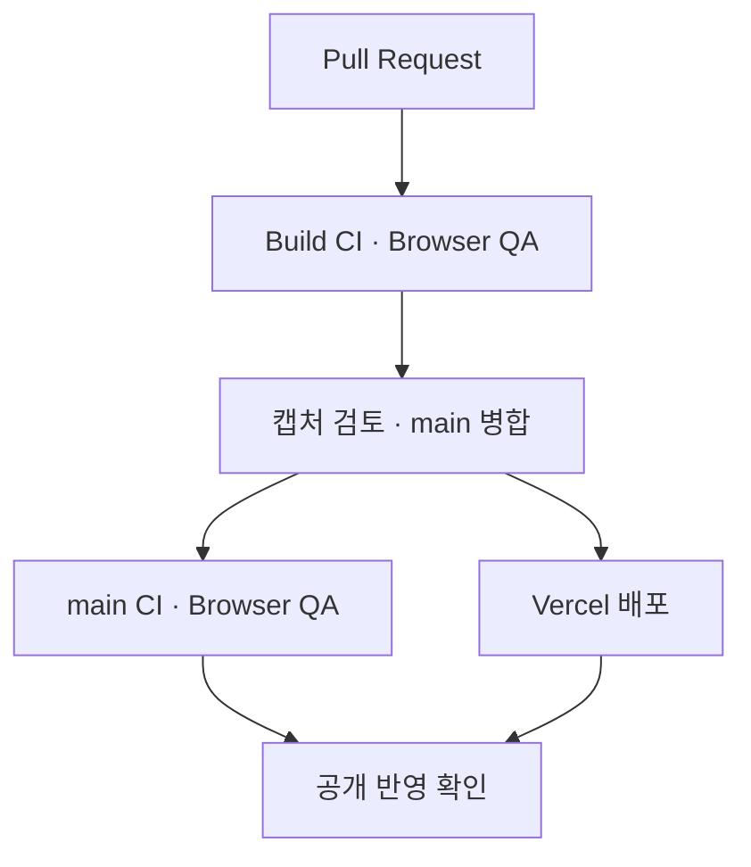

# Cloud Infrastructure Portfolio

> 프로젝트의 서비스 경로, 개인 기여, 운영·복구 검증을 한곳에서 읽는 박희철의 공개 Web Portfolio입니다.

**[포트폴리오 열기 →](https://cloud-infra-portfolio.vercel.app/)** · [GitHub Profile](https://github.com/wkfkeha784-pixel) · [Email](mailto:wkfkeha784@gmail.com)

## 프로젝트 바로가기

| Case Study | 담당 역할과 주요 경험 |
|---|---|
| [**Team Durian**](https://cloud-infra-portfolio.vercel.app/projects/durian) | Kubernetes·Redis/Kafka/KEDA 운영 · HTTP 요청 수락·확장/축소 · Terraform Drift 복구 |
| [**Bluebell**](https://cloud-infra-portfolio.vercel.app/projects/bluebell) | Team Lead · AWS Web–WAS 구축 · Replacement 이후 서비스 정상화 검증 |
| [**OneReport**](https://cloud-infra-portfolio.vercel.app/projects/onereport) | Backend · Domain/DB·Routing·Contract · Rule-based Analysis |
| [**Labbit**](https://cloud-infra-portfolio.vercel.app/projects/labbit) | Frontend/Design · HTTP/WebSocket Consumer · Terminal·File 통합·코드/CI 검증 |

Home에서 주요 프로젝트와 경력·교육·자격·연락처를 확인하고, 각 Case Study에서 **담당 역할 → 서비스 흐름 → 해결한 문제 → 검증 근거와 조건**을 읽을 수 있습니다.

## PDF · Web · GitHub

| 자료 | 역할 |
|---|---|
| **PDF** | 회사 지원 시 제출하는 핵심 요약본 |
| **Web** | 프로젝트별 상세 Case Study와 공개 가능한 Evidence Snapshot |
| **GitHub** | 공개 가능한 코드·PR·테스트·검증 기록 원본 |

이 저장소는 포트폴리오 웹의 소스입니다. 프로젝트별 팀 저장소와 공개 범위는 각 Case Study에서 구분합니다.

## 기술 구성

| 구분 | 도구 |
|---|---|
| Application | React · TypeScript · Vite · React Router |
| Verification | Playwright · GitHub Actions |
| Hosting | Vercel |

## 로컬 실행과 검증

GitHub Actions는 Node.js 20을 사용합니다.

```bash
npm install
npm run dev
```

개발 서버를 종료한 뒤 필요한 검증 명령을 실행합니다.

```bash
npm run lint
npm run build
npx playwright install chromium
npm run preview -- --host 127.0.0.1
```

Preview 서버를 켠 상태로 **다른 터미널**에서 실행합니다.

```bash
npm run qa:ui
```

기본 검증 대상은 `http://127.0.0.1:4173`입니다. QA는 서버를 자동 시작하지 않으므로 위 Preview 서버가 먼저 실행되어 있어야 합니다.

## Browser QA · 공개 반영

GitHub Actions의 PR·`main` push에서 다음을 확인합니다.

- Home + 4개 Case Study 직접 접근·Reload·프로젝트 이동
- Desktop·Tablet·Mobile 폭의 레이아웃과 가로 넘침
- 키보드 탐색·섹션 이동·URL hash·브라우저 이동 회귀
- 공개 전화번호 및 OneReport 비공개 Repository/PR 링크 미노출
- Labbit 공개 Evidence 링크와 프로젝트 Claim/Boundary 정합
- Full-page screenshot artifact 생성



PR 검증과 캡처 검토 후 병합합니다. 이후 main 검증 결과와 Vercel Production 상태를 함께 확인하며, PR 검사 통과만으로 공개 배포 완료를 판단하지 않습니다.

## 소스와 작업 기록

| 경로 | 내용 |
|---|---|
| [`src/data/projects.ts`](src/data/projects.ts) | 프로젝트 역할·성과·Evidence·검증 범위 |
| [`src/data/`](src/data/) | 프로젝트별 상세 읽기 구성 |
| [`src/pages/`](src/pages/) · [`src/components/`](src/components/) | Home·Case Study·공통 UI |
| [`src/styles/`](src/styles/) | 공통·프로젝트별 반응형 스타일 |
| [`src/App.tsx`](src/App.tsx) · [`src/main.tsx`](src/main.tsx) | 라우팅·앱 진입 |
| [`tests/`](tests/) · [`.github/workflows/`](.github/workflows/) | 브라우저 회귀 검증·CI |
| [웹 구성 개선 기록](docs/PORTFOLIO_WEB_REDESIGN_2026-10-10.md) | 2026-10-10 웹 개선 단계와 검증 결과 |
| [GitHub 소개 화면 정리 기록](docs/GITHUB_PRESENTATION_2026-10-10.md) | Profile·README 개선 범위와 확인 사항 |
| [공개 첫인상 점검](docs/PUBLIC_FIRST_IMPRESSION_REVIEW_2026-10-10.md) | 방문 경로 점검·탭/공유 카드 보완·계정 설정 안내 |

## 성과와 검증 범위

- **개인 기여 / 팀 결과 / 후속 과제**를 구분하며, 검증되지 않은 KPI를 만들지 않습니다.
- **Durian:** HTTP 300/300은 비동기 요청 수락 Evidence입니다. DB 300건 전체 Commit 완료로 확대하지 않습니다.
- **Bluebell:** Recovery Trigger 설계와 최종 통제 실행 E2E를 구분합니다. 최종 E2E에서는 EventBridge Rule 2개를 DISABLED로 유지했습니다.
- **OneReport:** Rule-based Analysis를 구현했습니다. PR #30 시점 health 502와 배포 정상화 후 8/21 최종 운영 Smoke PASS를 구분합니다. 비공개 팀 저장소의 직접 Repository/PR 링크 대신 공개 Evidence Snapshot을 제공합니다.
- **Labbit:** Terminal·File PR #62 main 병합과 코드/CI 검증 완료를 명시합니다. 실제 OpenStack VM PTY/SFTP E2E는 후속 통합 검증 범위입니다.
- 확인된 성과와 해결한 문제를 먼저 설명하고 필요한 조건을 가까이 표시합니다. 공개 접근이 불안정한 Repository 링크는 노출하지 않습니다.

## 공개 연락처

공개 Web에는 Email과 GitHub만 표시합니다. 전화번호가 포함된 회사 제출용 PDF는 공개 저장소·Web에 게시하지 않고 지원 과정에서 별도로 제공합니다.
