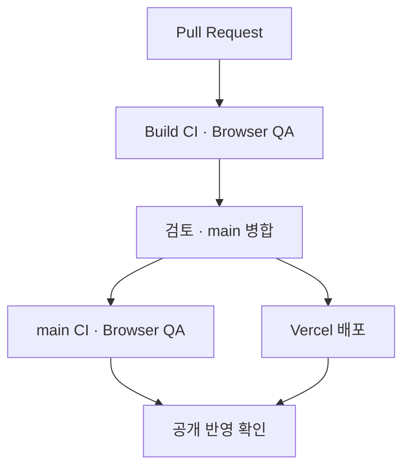

# 포트폴리오 관리 기록

[포트폴리오](https://cloud-infra-portfolio.vercel.app/)에는 프로젝트별 역할과 검증 결과를, [저장소 README](../README.md)에는 실행 방법과 소스 구성을 정리했습니다. 이 폴더에는 변경 이유와 확인 결과를 남깁니다.

## 현재 상태 · 2026-10-11

홈과 네 프로젝트 상세의 구성 개선, GitHub 소개 정리, 아이콘·공유 이미지와 계정 설정 정리를 마쳤습니다. 현재 진행 중인 화면 개편 단계는 없습니다.

최종 검토에서 소개 문구와 공개 테스트 파일의 연락처를 정리했습니다. 현재 소스 제거와 과거 Git 이력 정리의 차이, 실행 결과와 접속 제한은 아래 최종 검토 기록에 남겼습니다.

프로필·포트폴리오 두 개인 저장소는 공개로 유지합니다. Labbit은 팀 저장소와 개인 PR을 근거로 연결하며, 사용하지 않는 개인 포크는 사용자가 삭제했습니다. 프로젝트 자체의 후속 검증 상태와 포트폴리오 화면 작업의 완료 상태는 구분합니다.

## 기록

| 기록 | 내용 |
|---|---|
| [포트폴리오·공개 GitHub 최종 검토](FINAL_PUBLIC_REVIEW_2026-10-11.md) | 채용 담당자 진입 동선, 역할·근거 대조, 소개 문구와 최종 검증 |
| [공개 화면 점검과 설정 완료](PUBLIC_FIRST_IMPRESSION_REVIEW_2026-10-10.md) | 최신 공개 설정, 포크 삭제 근거, README 문구 정리, 검증 범위 |
| [GitHub 소개 화면 정리](GITHUB_PRESENTATION_2026-10-10.md) | 첫 README 개선과 실행 안내 검토 |
| [웹 구성 개선](PORTFOLIO_WEB_REDESIGN_2026-10-10.md) | 홈·네 상세의 구성, PR별 변경·화면·검증·배포 기록 |

기록의 제목 날짜는 해당 작업을 시작한 날짜입니다. 후속 확인일과 코드 기준은 각 기록에 따로 표시합니다.

## 검증과 배포

앱 코드를 변경할 때는 관련 검사와 캡처를 확인한 뒤 병합합니다. 공개 반영은 main 검사 결과와 Vercel 배포 상태를 함께 확인합니다. PR 검사만으로 배포 완료를 판단하지 않습니다.

문서만 바꾼 경우 파일 내용·링크·변경 범위를 확인합니다. 기존 앱 코드의 검사 결과를 새 코드에 대한 검사처럼 기록하지 않습니다.

## 다음 변경 기준

- 새 프로젝트 근거가 생기면 해당 역할·결과·검증 시점을 갱신합니다.
- 특히 Labbit의 실제 VM PTY/SFTP 연동은 새로운 E2E 자료를 확인한 뒤 완료로 표시합니다.
- 공개 URL과 프로젝트 근거 링크가 바뀌면 프로필·README·웹의 연결을 함께 확인합니다.
- 소개에는 필요한 경험을 먼저 두고, 반복되는 조건과 긴 작업 설명은 정리합니다. 중요한 검증 조건은 해당 결과 가까이에 유지합니다.
- 팀 문서·코드·설정과 회사 제출용 PDF/PPTX는 별도 요청 없이 변경하지 않습니다.
